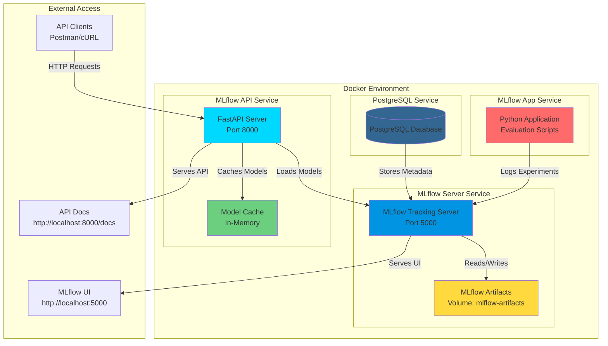
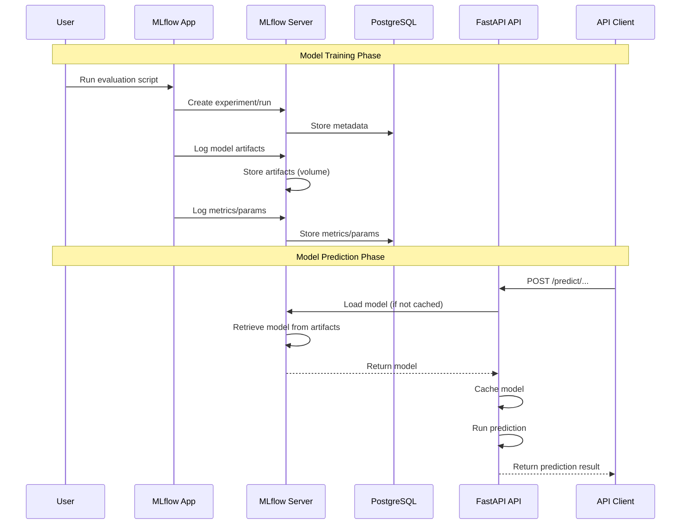
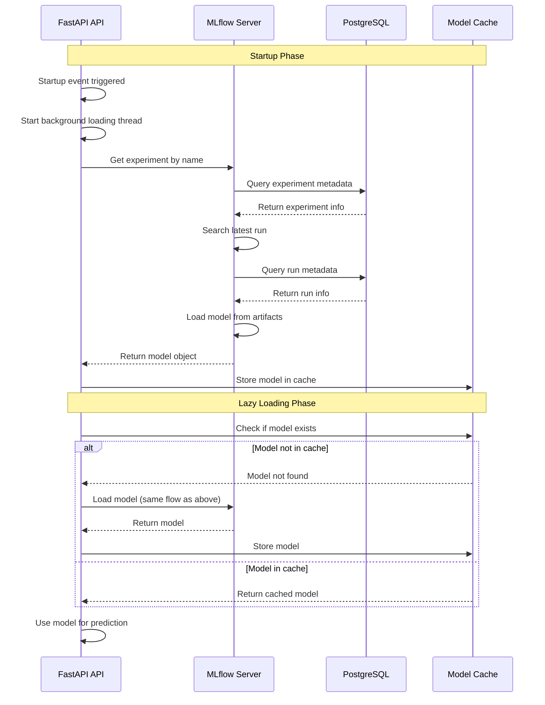
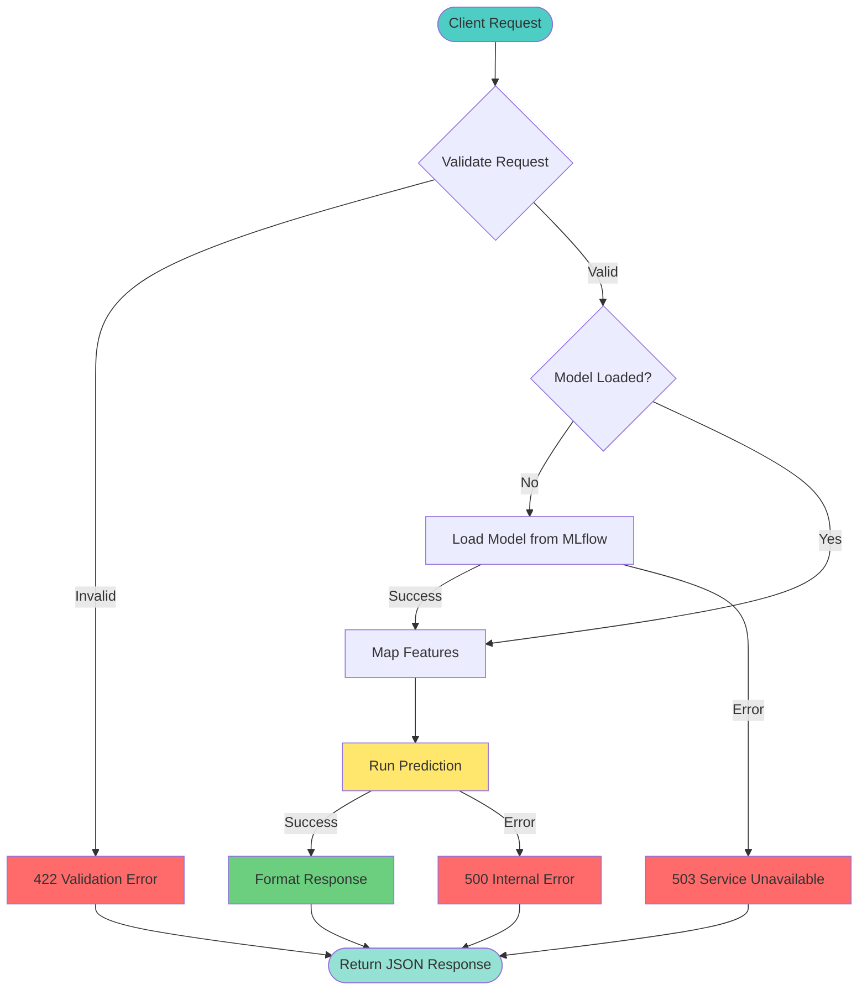
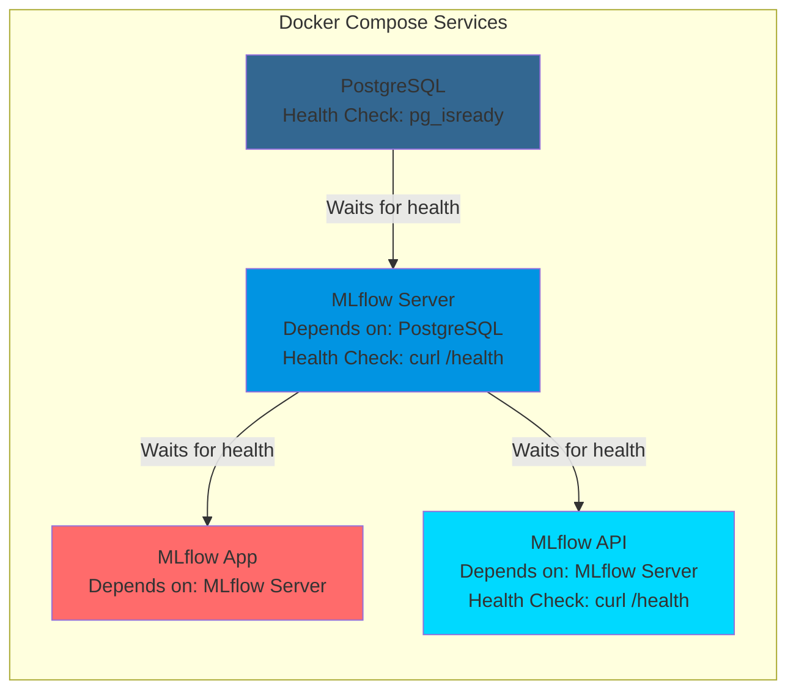
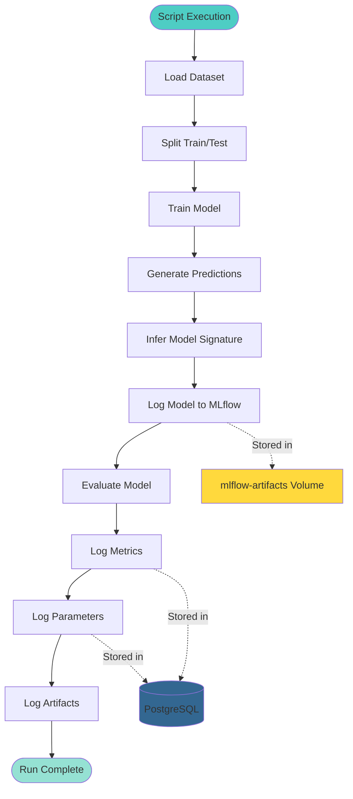
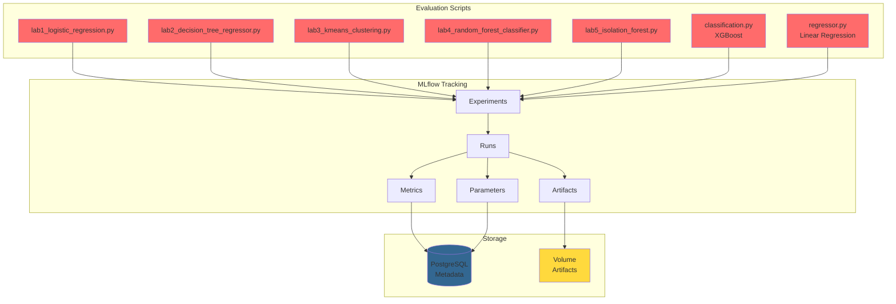

# MLflow Evaluation Lab - Comprehensive Guide

## Table of Contents

1. [Theoretical Discussion of Algorithms](#1-theoretical-discussion-of-algorithms)
2. [Dataset Descriptions](#2-dataset-descriptions)
3. [Code Explanations](#3-code-explanations)
4. [Docker Deployment](#4-docker-deployment)
5. [Postman Testing Guide](#5-postman-testing-guide)
6. [Architecture Diagrams](#6-architecture-diagrams)

---

## 1. Theoretical Discussion of Algorithms

### 1.1 Logistic Regression

**Overview:**
Logistic Regression is a linear classification algorithm that models the probability of a binary outcome using the logistic function (sigmoid). Despite its name, it's used for classification, not regression.

**Mathematical Foundation:**
- **Sigmoid Function**: σ(z) = 1 / (1 + e^(-z))
- **Decision Boundary**: Linear boundary separating classes
- **Cost Function**: Binary cross-entropy loss
- **Optimization**: Gradient descent or variants (L-BFGS, Newton's method)

**Key Characteristics:**
- **Interpretability**: Coefficients indicate feature importance
- **Probabilistic Output**: Provides probability scores, not just class labels
- **Linearity**: Assumes linear relationship between features and log-odds
- **Regularization**: L1 (Lasso) or L2 (Ridge) can prevent overfitting

**Use Cases:**
- Binary classification problems
- When probability estimates are needed
- Medical diagnosis (e.g., breast cancer detection)
- Credit scoring
- Spam detection

**Advantages:**
- Fast training and prediction
- No hyperparameter tuning required (basic version)
- Provides probability estimates
- Less prone to overfitting with regularization

**Disadvantages:**
- Assumes linear decision boundary
- Sensitive to outliers
- Requires feature scaling for best performance
- May underperform on non-linear problems

---

### 1.2 Decision Tree Regressor

**Overview:**
Decision Tree Regressor is a non-parametric supervised learning algorithm that builds a tree-like model of decisions to predict continuous target values.

**Mathematical Foundation:**
- **Splitting Criterion**: 
  - Mean Squared Error (MSE): Minimize variance in child nodes
  - Mean Absolute Error (MAE): Minimize absolute deviations
- **Stopping Criteria**: Maximum depth, minimum samples per leaf, minimum impurity decrease
- **Prediction**: Average of target values in leaf node

**Key Characteristics:**
- **Non-linear**: Can capture complex relationships
- **Feature Selection**: Automatically selects important features
- **Interpretability**: Tree structure is human-readable
- **No Assumptions**: No assumptions about data distribution

**Use Cases:**
- Regression problems with non-linear relationships
- Feature importance analysis
- When interpretability is important
- Real estate price prediction
- Sales forecasting

**Advantages:**
- Easy to understand and visualize
- Handles non-linear relationships
- No feature scaling required
- Handles missing values
- Feature importance scores

**Disadvantages:**
- Prone to overfitting
- Sensitive to small data changes
- Can create biased trees with imbalanced classes
- May not generalize well

---

### 1.3 K-Means Clustering

**Overview:**
K-Means is an unsupervised learning algorithm that partitions data into k clusters by minimizing within-cluster sum of squares (WCSS).

**Mathematical Foundation:**
- **Objective Function**: Minimize Σ Σ ||x - μᵢ||²
  - Where μᵢ is the centroid of cluster i
- **Algorithm Steps**:
  1. Initialize k centroids randomly
  2. Assign each point to nearest centroid
  3. Update centroids as mean of assigned points
  4. Repeat steps 2-3 until convergence

**Key Characteristics:**
- **Unsupervised**: No labels required
- **Centroid-based**: Uses cluster centers
- **Distance Metric**: Typically Euclidean distance
- **Convergence**: Guaranteed to converge (may be local optimum)

**Use Cases:**
- Customer segmentation
- Image segmentation
- Anomaly detection
- Data exploration
- Pattern recognition

**Advantages:**
- Simple and fast
- Works well with spherical clusters
- Scales to large datasets
- Easy to implement

**Disadvantages:**
- Requires pre-specification of k
- Sensitive to initialization
- Assumes spherical clusters
- Sensitive to outliers
- May converge to local optimum

**Evaluation Metrics:**
- **Silhouette Score**: Measures how similar an object is to its own cluster vs. other clusters (-1 to 1, higher is better)
- **Davies-Bouldin Index**: Average similarity ratio of clusters (lower is better)
- **Calinski-Harabasz Index**: Ratio of between-cluster to within-cluster dispersion (higher is better)
- **Inertia**: Within-cluster sum of squares (lower is better)

---

### 1.4 Random Forest Classifier

**Overview:**
Random Forest is an ensemble learning method that combines multiple decision trees to improve prediction accuracy and reduce overfitting.

**Mathematical Foundation:**
- **Bootstrap Aggregating (Bagging)**: Trains multiple trees on random subsets of data
- **Feature Randomness**: Each split considers random subset of features
- **Voting**: Classification uses majority vote, regression uses average
- **Out-of-Bag (OOB) Error**: Validation using samples not in bootstrap

**Key Characteristics:**
- **Ensemble Method**: Combines multiple weak learners
- **Randomization**: Reduces overfitting through randomness
- **Feature Importance**: Aggregates importance across trees
- **Robustness**: Less sensitive to outliers than single trees

**Use Cases:**
- Classification with high-dimensional data
- Feature importance analysis
- When interpretability is less critical than accuracy
- Medical diagnosis
- Fraud detection

**Advantages:**
- Reduces overfitting compared to single trees
- Handles missing values
- Provides feature importance
- Works well with default parameters
- Handles non-linear relationships

**Disadvantages:**
- Less interpretable than single trees
- Can be slow for large datasets
- Memory intensive
- May overfit with noisy data
- Black box nature

---

### 1.5 Isolation Forest

**Overview:**
Isolation Forest is an unsupervised anomaly detection algorithm that isolates anomalies instead of profiling normal data points.

**Mathematical Foundation:**
- **Isolation Principle**: Anomalies are easier to isolate (fewer splits needed)
- **Isolation Tree**: Binary tree where each node randomly selects feature and split value
- **Path Length**: Number of edges from root to leaf (anomalies have shorter paths)
- **Anomaly Score**: s(x, n) = 2^(-E(h(x))/c(n))
  - Where E(h(x)) is average path length, c(n) is normalization constant

**Key Characteristics:**
- **Unsupervised**: No labels required
- **Efficient**: O(n log n) time complexity
- **Scalable**: Works well with high-dimensional data
- **Interpretability**: Can identify which features contribute to anomaly

**Use Cases:**
- Fraud detection
- Network intrusion detection
- Manufacturing defect detection
- Outlier detection in datasets
- Quality control

**Advantages:**
- Fast and efficient
- Works with high-dimensional data
- No assumptions about data distribution
- Handles multiple anomaly types
- Low memory requirement

**Disadvantages:**
- May struggle with high-dimensional sparse data
- Sensitive to contamination parameter
- Less interpretable than some methods
- May miss contextual anomalies

**Output Interpretation:**
- **-1**: Anomaly (outlier)
- **1**: Normal (inlier)

---

### 1.6 XGBoost Classifier

**Overview:**
XGBoost (Extreme Gradient Boosting) is an optimized gradient boosting framework that uses ensemble of weak learners (decision trees) with gradient descent optimization.

**Mathematical Foundation:**
- **Gradient Boosting**: Sequentially adds trees that correct previous errors
- **Objective Function**: L(θ) = Σ l(yᵢ, ŷᵢ) + Σ Ω(fₖ)
  - Loss function + regularization term
- **Tree Construction**: Uses second-order gradient information (Hessian)
- **Regularization**: L1 (alpha) and L2 (lambda) regularization

**Key Characteristics:**
- **Gradient Boosting**: Sequential error correction
- **Regularization**: Built-in L1 and L2 regularization
- **Parallel Processing**: Parallel tree construction
- **Handles Missing Values**: Automatic handling
- **Feature Importance**: Multiple importance types

**Use Cases:**
- Classification and regression
- Kaggle competitions (often top performer)
- Large-scale machine learning
- When accuracy is critical
- Structured/tabular data

**Advantages:**
- High predictive accuracy
- Handles missing values automatically
- Regularization prevents overfitting
- Fast training and prediction
- Feature importance scores

**Disadvantages:**
- Requires hyperparameter tuning
- Less interpretable than simpler models
- Can overfit with small datasets
- Memory intensive for large datasets
- Sensitive to hyperparameters

---

### 1.7 Linear Regressor

**Overview:**
Linear Regression models the relationship between features and a continuous target variable using a linear equation.

**Mathematical Foundation:**
- **Model**: y = β₀ + β₁x₁ + β₂x₂ + ... + βₙxₙ + ε
- **Cost Function**: Mean Squared Error (MSE) = (1/n) Σ(yᵢ - ŷᵢ)²
- **Optimization**: Ordinary Least Squares (OLS) or gradient descent
- **Assumptions**: 
  - Linearity
  - Independence
  - Homoscedasticity
  - Normality of errors

**Key Characteristics:**
- **Linearity**: Assumes linear relationship
- **Interpretability**: Coefficients show feature impact
- **Efficiency**: Fast training and prediction
- **Baseline**: Often used as baseline model

**Use Cases:**
- Price prediction
- Sales forecasting
- Risk assessment
- When interpretability is important
- Baseline for comparison

**Advantages:**
- Simple and interpretable
- Fast training and prediction
- No hyperparameter tuning needed
- Provides confidence intervals
- Works well with many features

**Disadvantages:**
- Assumes linear relationship
- Sensitive to outliers
- Requires feature scaling
- May underfit complex relationships
- Assumes independence of features

**Evaluation Metrics:**
- **MAE (Mean Absolute Error)**: Average absolute difference
- **RMSE (Root Mean Squared Error)**: Square root of average squared difference
- **R² (Coefficient of Determination)**: Proportion of variance explained (0 to 1, higher is better)

---

## 2. Dataset Descriptions

### 2.1 Breast Cancer Wisconsin Dataset

**Source:** `sklearn.datasets.load_breast_cancer`

**Purpose:** Binary classification (malignant vs. benign tumors)

**Dataset Characteristics:**
- **Samples**: 569
- **Features**: 30 (all numeric)
- **Target**: Binary (0 = malignant, 1 = benign)
- **Classes**: 2 (Malignant: 212, Benign: 357)

**Input Features (30 features):**

The dataset contains measurements of cell nuclei from breast mass images. Features are computed from digitized images and describe characteristics of cell nuclei.

**Mean Features (10):**
1. `mean radius` - Mean of distances from center to points on perimeter
2. `mean texture` - Standard deviation of gray-scale values
3. `mean perimeter` - Mean size of the core tumor
4. `mean area` - Mean area of the core tumor
5. `mean smoothness` - Local variation in radius lengths
6. `mean compactness` - Perimeter² / area - 1.0
7. `mean concavity` - Severity of concave portions of the contour
8. `mean concave points` - Number of concave portions of the contour
9. `mean symmetry` - Symmetry of the cell
10. `mean fractal dimension` - "Coastline approximation" - 1

**Standard Error Features (10):**
11. `radius error` - Standard error of radius
12. `texture error` - Standard error of texture
13. `perimeter error` - Standard error of perimeter
14. `area error` - Standard error of area
15. `smoothness error` - Standard error of smoothness
16. `compactness error` - Standard error of compactness
17. `concavity error` - Standard error of concavity
18. `concave points error` - Standard error of concave points
19. `symmetry error` - Standard error of symmetry
20. `fractal dimension error` - Standard error of fractal dimension

**Worst Features (10):**
21. `worst radius` - Largest mean radius
22. `worst texture` - Largest standard deviation of gray-scale values
23. `worst perimeter` - Largest perimeter
24. `worst area` - Largest area
25. `worst smoothness` - Largest local variation
26. `worst compactness` - Largest compactness
27. `worst concavity` - Largest concavity
28. `worst concave points` - Largest number of concave portions
29. `worst symmetry` - Largest symmetry
30. `worst fractal dimension` - Largest fractal dimension

**Target Feature:**
- **`target`**: Binary classification
  - `0` = Malignant (cancerous)
  - `1` = Benign (non-cancerous)

**Used In:**
- Lab 1: Logistic Regression
- Lab 5: Isolation Forest (anomaly detection)

---

### 2.2 California Housing Dataset

**Source:** `sklearn.datasets.fetch_california_housing`

**Purpose:** Regression (predicting median house value)

**Dataset Characteristics:**
- **Samples**: 20,640
- **Features**: 8 (all numeric)
- **Target**: Continuous (median house value in hundreds of thousands of dollars)

**Input Features (8 features):**

1. **`MedInc`** (Median Income)
   - Median income in block group
   - Range: ~0.5 to ~15
   - Unit: Tens of thousands of dollars

2. **`HouseAge`** (House Age)
   - Median house age in block group
   - Range: 1 to 52 years

3. **`AveRooms`** (Average Rooms)
   - Average number of rooms per household
   - Range: ~0.8 to ~140

4. **`AveBedrms`** (Average Bedrooms)
   - Average number of bedrooms per household
   - Range: ~0.3 to ~50

5. **`Population`** (Population)
   - Block group population
   - Range: 3 to 35,682

6. **`AveOccup`** (Average Occupancy)
   - Average number of household members
   - Range: ~0.7 to ~1,243

7. **`Latitude`** (Latitude)
   - Block group latitude
   - Range: 32.54 to 41.95 (California)

8. **`Longitude`** (Longitude)
   - Block group longitude
   - Range: -124.35 to -114.31 (California)

**Target Feature:**
- **`target`**: Median house value
  - Unit: Hundreds of thousands of dollars
  - Range: ~0.15 to ~5.0
  - Example: 4.21 = $421,000

**Used In:**
- Lab 2: Decision Tree Regressor
- Linear Regressor (regressor.py)

---

### 2.3 Iris Dataset

**Source:** `sklearn.datasets.load_iris`

**Purpose:** Multi-class classification (iris species identification)

**Dataset Characteristics:**
- **Samples**: 150
- **Features**: 4 (all numeric, in centimeters)
- **Target**: Multi-class (3 species)
- **Classes**: 3 (Setosa: 50, Versicolor: 50, Virginica: 50)

**Input Features (4 features):**

1. **`sepal length (cm)`**
   - Length of sepal (outer part of flower)
   - Range: 4.3 to 7.9 cm

2. **`sepal width (cm)`**
   - Width of sepal
   - Range: 2.0 to 4.4 cm

3. **`petal length (cm)`**
   - Length of petal (inner part of flower)
   - Range: 1.0 to 6.9 cm

4. **`petal width (cm)`**
   - Width of petal
   - Range: 0.1 to 2.5 cm

**Target Feature:**
- **`target`**: Iris species
  - `0` = Setosa
  - `1` = Versicolor
  - `2` = Virginica

**Used In:**
- Lab 3: K-Means Clustering (unsupervised, no labels used)
- Lab 4: Random Forest Classifier

---

### 2.4 Adult Dataset (Census Income)

**Source:** `shap.datasets.adult()` (UCI Machine Learning Repository)

**Purpose:** Binary classification (income prediction)

**Dataset Characteristics:**
- **Samples**: 32,561 (training) + 16,281 (test)
- **Features**: 14 (mix of numeric and categorical)
- **Target**: Binary (>50K or <=50K income)

**Input Features (14 features):**

**Numeric Features:**
1. **`age`** - Age of individual (17-90)
2. **`fnlwgt`** - Final weight (sampling weight)
3. **`education-num`** - Numeric representation of education level (1-16)
4. **`capital-gain`** - Capital gains (0-99999)
5. **`capital-loss`** - Capital losses (0-4356)
6. **`hours-per-week`** - Hours worked per week (1-99)

**Categorical Features:**
7. **`workclass`** - Type of employment (Private, Self-emp-not-inc, etc.)
8. **`education`** - Education level (Bachelors, Some-college, etc.)
9. **`marital-status`** - Marital status (Married-civ-spouse, Divorced, etc.)
10. **`occupation`** - Occupation type (Tech-support, Craft-repair, etc.)
11. **`relationship`** - Relationship status (Husband, Wife, etc.)
12. **`race`** - Race (White, Black, Asian-Pac-Islander, etc.)
13. **`sex`** - Gender (Male, Female)
14. **`native-country`** - Country of origin (United-States, Mexico, etc.)

**Target Feature:**
- **`target`**: Income level
  - `0` = <=50K (low income)
  - `1` = >50K (high income)

**Used In:**
- XGBoost Classifier (classification.py)

---

## 3. Code Explanations

### 3.1 Lab 1: Logistic Regression (`lab1_logistic_regression.py`)

**Purpose:** Binary classification of breast cancer tumors (malignant vs. benign)

**Code Flow:**

```python
# 1. Setup and Configuration
- Set MLflow tracking URI
- Create/select experiment: "lab1-logistic-regression"
- Load breast cancer dataset (30 features, binary target)

# 2. Data Preparation
- Split data: 80% train, 20% test
- Prepare evaluation data with target column

# 3. Model Training
- Initialize LogisticRegression (max_iter=1000, random_state=42)
- Fit model on training data

# 4. MLflow Tracking
with mlflow.start_run():
    # Infer signature from test data
    signature = infer_signature(X_test, y_pred)
    
    # Log model with signature
    mlflow.sklearn.log_model(model, "model", signature=signature)
    
    # Log hyperparameters
    mlflow.log_params({"max_iter": 1000, "random_state": 42, "solver": "lbfgs"})
    
    # Evaluate model
    result = mlflow_evaluate(
        model=predict_fn,
        data=eval_data,
        targets="label",
        model_type="classifier",
        evaluators=["default"]
    )
    
    # Print metrics (accuracy, F1, ROC AUC, precision, recall)
```

**Key Components:**
- **Model Signature**: Defines input/output schema for API deployment
- **MLflow Evaluate**: Automatically calculates classification metrics
- **Metrics Logged**: Accuracy, F1 Score, ROC AUC, Precision, Recall

**Evaluation Metrics Explained:**
- **Accuracy**: (TP + TN) / (TP + TN + FP + FN) - Overall correctness
- **F1 Score**: 2 × (Precision × Recall) / (Precision + Recall) - Harmonic mean
- **ROC AUC**: Area under ROC curve - Model's ability to distinguish classes
- **Precision**: TP / (TP + FP) - Of predicted positives, how many are correct
- **Recall**: TP / (TP + FN) - Of actual positives, how many were found

---

### 3.2 Lab 2: Decision Tree Regressor (`lab2_decision_tree_regressor.py`)

**Purpose:** Predict median house value using decision tree regression

**Code Flow:**

```python
# 1. Setup
- Experiment: "lab2-decision-tree-regressor"
- Load California Housing dataset (8 features, continuous target)

# 2. Data Preparation
- Split: 80% train, 20% test
- Prepare evaluation data

# 3. Model Training
- DecisionTreeRegressor(max_depth=10, random_state=42)
- Fit on training data

# 4. MLflow Tracking
with mlflow.start_run():
    # Infer signature
    signature = infer_signature(X_test, y_pred)
    
    # Log model
    mlflow.sklearn.log_model(model, "model", signature=signature)
    
    # Log parameters
    mlflow.log_params({
        "max_depth": 10,
        "random_state": 42,
        "criterion": "squared_error"
    })
    
    # Evaluate model
    result = mlflow_evaluate(
        model=predict_fn,
        data=eval_data,
        targets="target",
        model_type="regressor",
        evaluators=["default"]
    )
    
    # Print metrics (MAE, RMSE, R²)
```

**Key Components:**
- **Max Depth**: Limits tree depth to prevent overfitting
- **Regression Metrics**: MAE, RMSE, R² score
- **Feature Importance**: Decision trees provide feature importance scores

**Evaluation Metrics Explained:**
- **MAE (Mean Absolute Error)**: Average absolute difference between predicted and actual
- **RMSE (Root Mean Squared Error)**: Square root of average squared differences (penalizes large errors)
- **R² (R-squared)**: Proportion of variance explained (1.0 = perfect, 0.0 = no better than mean)

---

### 3.3 Lab 3: K-Means Clustering (`lab3_kmeans_clustering.py`)

**Purpose:** Unsupervised clustering of iris flowers into 3 groups

**Code Flow:**

```python
# 1. Setup
- Experiment: "lab3-kmeans-clustering"
- Load Iris dataset (features only, no labels for clustering)

# 2. Data Preparation
- Use all data (no train/test split for unsupervised learning)
- Sample for signature inference

# 3. Model Training
- KMeans(n_clusters=3, random_state=42, n_init=10)
- Fit on all data

# 4. MLflow Tracking
with mlflow.start_run():
    # Predict clusters
    y_pred = model.predict(X)
    
    # Infer signature
    signature = infer_signature(X_sample, model.predict(X_sample))
    
    # Log model
    mlflow.sklearn.log_model(model, "model", signature=signature)
    
    # Log parameters
    mlflow.log_params({
        "n_clusters": 3,
        "random_state": 42,
        "n_init": 10
    })
    
    # Calculate clustering metrics manually
    silhouette = silhouette_score(X, y_pred)
    davies_bouldin = davies_bouldin_score(X, y_pred)
    calinski_harabasz = calinski_harabasz_score(X, y_pred)
    inertia = model.inertia_
    
    # Log metrics
    mlflow.log_metrics({
        "silhouette_score": silhouette,
        "davies_bouldin_score": davies_bouldin,
        "calinski_harabasz_score": calinski_harabasz,
        "inertia": inertia
    })
```

**Key Components:**
- **Unsupervised Learning**: No labels used during training
- **Manual Metrics**: MLflow doesn't have built-in clustering evaluators
- **Cluster Validation**: Multiple metrics assess cluster quality

**Clustering Metrics Explained:**
- **Silhouette Score**: Measures how similar objects are to their cluster vs. others (-1 to 1)
- **Davies-Bouldin Index**: Average similarity ratio (lower is better)
- **Calinski-Harabasz Index**: Ratio of between-cluster to within-cluster dispersion (higher is better)
- **Inertia**: Within-cluster sum of squares (lower is better)

---

### 3.4 Lab 4: Random Forest Classifier (`lab4_random_forest_classifier.py`)

**Purpose:** Multi-class classification of iris species using ensemble of trees

**Code Flow:**

```python
# 1. Setup
- Experiment: "lab4-random-forest-classifier"
- Load Iris dataset (4 features, 3 classes)

# 2. Data Preparation
- Split: 80% train, 20% test
- Prepare evaluation data

# 3. Model Training
- RandomForestClassifier(n_estimators=100, max_depth=5, random_state=42)
- Fit on training data

# 4. MLflow Tracking
with mlflow.start_run():
    # Infer signature
    signature = infer_signature(X_test, y_pred)
    
    # Log model
    mlflow.sklearn.log_model(model, "model", signature=signature)
    
    # Log parameters
    mlflow.log_params({
        "n_estimators": 100,
        "max_depth": 5,
        "random_state": 42
    })
    
    # Evaluate model
    result = mlflow_evaluate(
        model=predict_fn,
        data=eval_data,
        targets="label",
        model_type="classifier",
        evaluators=["default"]
    )
    
    # Print metrics (accuracy, F1, precision, recall per class)
```

**Key Components:**
- **Ensemble Method**: Combines 100 decision trees
- **Multi-class Classification**: Handles 3 classes (setosa, versicolor, virginica)
- **Feature Importance**: Aggregates importance across all trees

---

### 3.5 Lab 5: Isolation Forest (`lab5_isolation_forest.py`)

**Purpose:** Anomaly detection on breast cancer dataset

**Code Flow:**

```python
# 1. Setup
- Experiment: "lab5-isolation-forest"
- Load breast cancer dataset (30 features)

# 2. Data Preparation
- Use all data (unsupervised)
- Sample for signature inference

# 3. Model Training
- IsolationForest(contamination=0.1, random_state=42)
- Fit on all data

# 4. MLflow Tracking
with mlflow.start_run():
    # Predict anomalies
    y_pred = model.predict(X)
    
    # Infer signature
    signature = infer_signature(X_sample, model.predict(X_sample))
    
    # Log model
    mlflow.sklearn.log_model(model, "model", signature=signature)
    
    # Log parameters
    mlflow.log_params({
        "contamination": 0.1,
        "random_state": 42,
        "n_estimators": 100
    })
    
    # Calculate metrics manually
    n_anomalies = (y_pred == -1).sum()
    n_normal = (y_pred == 1).sum()
    anomaly_ratio = n_anomalies / len(y_pred)
    
    # Log metrics
    mlflow.log_metrics({
        "n_anomalies": n_anomalies,
        "n_normal": n_normal,
        "anomaly_ratio": anomaly_ratio
    })
```

**Key Components:**
- **Contamination Parameter**: Expected proportion of anomalies (0.1 = 10%)
- **Anomaly Detection**: Returns -1 (anomaly) or 1 (normal)
- **Unsupervised**: No labels required

---

### 3.6 XGBoost Classifier (`classification.py`)

**Purpose:** Binary classification on Adult dataset with SHAP explainability

**Code Flow:**

```python
# 1. Setup
- Experiment: "evaluation-classification"
- Load Adult dataset from SHAP

# 2. Data Preparation
- Split: 80% train, 20% test
- XGBoost handles categorical features automatically

# 3. Model Training
- XGBClassifier() with default parameters
- Fit on training data

# 4. MLflow Tracking
with mlflow.start_run():
    # Infer signature
    signature = infer_signature(X_test, y_pred)
    
    # Log model
    mlflow.sklearn.log_model(model, "model", signature=signature)
    
    # Evaluate model
    result = mlflow_evaluate(...)
    
    # SHAP Explainability
    explainer = shap.TreeExplainer(model)
    shap_values = explainer.shap_values(X_test[:100])
    
    # Create SHAP plots
    shap.summary_plot(shap_values, X_test[:100], show=False)
    plt.savefig("shap_summary.png")
    
    # Log SHAP plot as artifact
    mlflow.log_artifact("shap_summary.png")
```

**Key Components:**
- **SHAP (SHapley Additive exPlanations)**: Explains model predictions
- **Feature Importance**: Shows which features drive predictions
- **Artifact Logging**: Saves SHAP plots to MLflow

---

### 3.7 Linear Regressor (`regressor.py`)

**Purpose:** Predict median house value using linear regression

**Code Flow:**

```python
# 1. Setup
- Experiment: "evaluation-regression"
- Load California Housing dataset

# 2. Data Preparation
- Split: 80% train, 20% test
- Prepare evaluation data

# 3. Model Training
- LinearRegression()
- Fit on training data

# 4. MLflow Tracking
with mlflow.start_run():
    # Infer signature
    signature = infer_signature(X_test, y_pred)
    
    # Log model
    mlflow.sklearn.log_model(model, "model", signature=signature)
    
    # Evaluate model
    result = mlflow_evaluate(
        model=predict_fn,
        data=eval_data,
        targets="target",
        model_type="regressor",
        evaluators=["default"]
    )
    
    # Print metrics (MAE, RMSE, R²)
```

---

### 3.8 FastAPI Prediction Service (`api_server.py`)

**Purpose:** RESTful API for real-time model predictions

**Architecture:**

```python
# 1. Application Setup
- FastAPI app with CORS middleware
- MLflow tracking URI configuration
- Global model cache dictionary

# 2. Model Loading
- Background loading on startup (non-blocking)
- Lazy loading on first request if not loaded
- Error handling for missing models

# 3. Feature Mapping
- map_breast_cancer_features(): Maps API names to sklearn names
- Handles underscore vs. space differences

# 4. Prediction Endpoints
- /predict/lab1-logistic-regression
- /predict/lab2-decision-tree-regressor
- /predict/lab3-kmeans-clustering
- /predict/lab4-random-forest
- /predict/lab5-isolation-forest
- /predict/xgboost-classifier
- /predict/linear-regressor

# 5. Health Check
- /health: Returns status and loaded models
```

**Key Functions:**

**`load_model_from_latest_run()`:**
- Retrieves latest run from MLflow experiment
- Loads model using MLflow's sklearn loader
- Handles experiment/run not found errors

**`ensure_model_loaded()`:**
- Checks if model is in cache
- Loads model if missing (lazy loading)
- Prevents duplicate loading attempts

**`map_breast_cancer_features()`:**
- Converts API feature names (underscores) to sklearn names (spaces)
- Required for Breast Cancer and Isolation Forest models

**Request/Response Flow:**

```
Client Request
    ↓
FastAPI Endpoint
    ↓
Pydantic Validation (feature names, types)
    ↓
Feature Mapping (if needed)
    ↓
Model Prediction
    ↓
Response Formatting
    ↓
JSON Response
```

**Error Handling:**
- 503 Service Unavailable: Model not loaded or currently loading
- 500 Internal Server Error: Prediction error (feature mismatch, etc.)
- Clear error messages with troubleshooting hints

---

## 4. Docker Deployment

### 4.1 Docker Compose Architecture

**Services:**

1. **PostgreSQL** (`postgres`)
   - Image: `postgres:15-alpine`
   - Port: 5432
   - Database: `mlflow`
   - User: `mlflow` / Password: `mlflow`
   - Volume: `postgres-data` (persistent)

2. **MLflow Server** (`mlflow-server`)
   - Built from: `Dockerfile.mlflow-server`
   - Port: 5000
   - Depends on: PostgreSQL (health check)
   - Volume: `mlflow-artifacts` (shared with app and API)

3. **MLflow App** (`mlflow-app`)
   - Built from: `Dockerfile`
   - Purpose: Run evaluation scripts
   - Depends on: MLflow Server (health check)
   - Volumes: `mlflow-artifacts` + project directory (bind mount)

4. **MLflow API** (`mlflow-api`)
   - Built from: `Dockerfile.api`
   - Port: 8000
   - Depends on: MLflow Server (health check)
   - Volume: `mlflow-artifacts` (for model loading)

**Volumes:**
- `postgres-data`: PostgreSQL database files
- `mlflow-artifacts`: MLflow model artifacts and runs

### 4.2 Dockerfile.mlflow-server

**Purpose:** MLflow tracking server with PostgreSQL support

```dockerfile
FROM python:3.11-slim

# Install system dependencies
RUN apt-get update && \
    apt-get install -y --no-install-recommends \
    postgresql-client curl && \
    rm -rf /var/lib/apt/lists/*

# Install Python dependencies
RUN pip install --upgrade pip && \
    pip install --no-cache-dir \
    mlflow>=2.0.0 \
    psycopg2-binary>=2.9.0

# Copy entrypoint script
COPY entrypoint-mlflow.sh /app/entrypoint-mlflow.sh
RUN chmod +x /app/entrypoint-mlflow.sh

WORKDIR /app

# Use entrypoint script
ENTRYPOINT ["/app/entrypoint-mlflow.sh"]
```

**Key Components:**
- `postgresql-client`: Provides `pg_isready` for health checks
- `psycopg2-binary`: PostgreSQL adapter for Python
- `entrypoint-mlflow.sh`: Custom startup script

### 4.3 entrypoint-mlflow.sh

**Purpose:** Wait for PostgreSQL and start MLflow server

```bash
#!/bin/bash
set -e

# Wait for PostgreSQL
until pg_isready -h "$POSTGRES_HOST" -p "$POSTGRES_PORT" -U "$POSTGRES_USER"; do
  echo "Waiting for PostgreSQL..."
  sleep 2
done

# Construct connection URI
export MLFLOW_BACKEND_STORE_URI="postgresql://${POSTGRES_USER}:${POSTGRES_PASSWORD}@${POSTGRES_HOST}:${POSTGRES_PORT}/${POSTGRES_DB}"

# Start MLflow server
exec mlflow server \
    --host 0.0.0.0 \
    --port 5000 \
    --backend-store-uri "$MLFLOW_BACKEND_STORE_URI" \
    --default-artifact-root /app/mlruns
```

**Key Features:**
- Waits for PostgreSQL to be ready
- Constructs PostgreSQL connection URI from environment variables
- Starts MLflow server with proper configuration

### 4.4 Dockerfile

**Purpose:** Python environment for running evaluation scripts

```dockerfile
FROM python:3.11-slim

# Install system dependencies
RUN apt-get update && \
    apt-get install -y --no-install-recommends gcc g++ && \
    rm -rf /var/lib/apt/lists/*

# Copy requirements and install
COPY requirements.txt .
COPY pip.conf /etc/pip.conf

RUN pip install --upgrade pip && \
    pip install --no-cache-dir --default-timeout=100 --retries 5 -r requirements.txt

WORKDIR /app

# Keep container running
CMD ["tail", "-f", "/dev/null"]
```

**Key Components:**
- `gcc`, `g++`: Required for compiling some Python packages
- `pip.conf`: Configuration for timeouts and retries
- Keeps container running for manual script execution

### 4.5 Dockerfile.api

**Purpose:** FastAPI server with model dependencies

```dockerfile
FROM python:3.11-slim

# Install system dependencies
RUN apt-get update && \
    apt-get install -y --no-install-recommends gcc g++ curl && \
    rm -rf /var/lib/apt/lists/*

# Install Python dependencies in batches
RUN pip install --upgrade pip && \
    pip install --no-cache-dir --default-timeout=100 --retries 5 \
    mlflow>=2.0.0 scikit-learn>=1.0.0 && \
    pip install --no-cache-dir --default-timeout=100 --retries 5 \
    xgboost>=2.0.0 shap>=0.40.0 && \
    pip install --no-cache-dir --default-timeout=100 --retries 5 \
    pandas>=1.5.0 numpy>=1.24.0 psycopg2-binary>=2.9.0 && \
    pip install --no-cache-dir --default-timeout=100 --retries 5 \
    fastapi>=0.104.0 uvicorn[standard]>=0.24.0 pydantic>=2.0.0 requests>=2.31.0

# Copy API server
COPY api_server.py .

EXPOSE 8000

# Set environment variables
ENV MLFLOW_TRACKING_URI=http://mlflow-server:5000
ENV MLFLOW_REGISTRY_URI=http://mlflow-server:5000
ENV GIT_PYTHON_REFRESH=quiet

# Run FastAPI server
CMD ["uvicorn", "api_server:app", "--host", "0.0.0.0", "--port", "8000"]
```

**Key Components:**
- Batch installation: Prevents timeout on large packages
- All model dependencies: MLflow, scikit-learn, XGBoost, SHAP
- FastAPI stack: FastAPI, Uvicorn, Pydantic
- Health check: Uses curl for health endpoint

### 4.6 Deployment Steps

**1. Build Images:**
```bash
docker-compose build
```

**2. Start Services:**
```bash
docker-compose up -d
```

**3. Verify Services:**
```bash
docker-compose ps
```

**4. Check Logs:**
```bash
# All services
docker-compose logs -f

# Specific service
docker-compose logs -f mlflow-api
```

**5. Run Experiments:**
```bash
# Individual
docker-compose exec mlflow-app python lab1_logistic_regression.py

# All experiments
docker-compose exec mlflow-app bash -c "./run_all_experiments.sh"
```

**6. Access Services:**
- MLflow UI: http://localhost:5000
- FastAPI Docs: http://localhost:8000/docs
- FastAPI Health: http://localhost:8000/health

**7. Stop Services:**
```bash
docker-compose down
```

**8. Clean Up (⚠️ Deletes Data):**
```bash
docker-compose down -v
```

### 4.7 Health Checks

**PostgreSQL:**
```yaml
healthcheck:
  test: ["CMD-SHELL", "pg_isready -U mlflow"]
  interval: 5s
  timeout: 5s
  retries: 5
```

**MLflow Server:**
```yaml
healthcheck:
  test: ["CMD", "curl", "-f", "http://127.0.0.1:5000/health"]
  interval: 10s
  timeout: 5s
  retries: 10
  start_period: 30s
```

**FastAPI:**
```yaml
healthcheck:
  test: ["CMD", "curl", "-f", "http://localhost:8000/health"]
  interval: 10s
  timeout: 5s
  retries: 10
  start_period: 600s  # 10 minutes for model loading
```

### 4.8 Network Configuration

**Docker Network:**
- All services on same network (default)
- Service names as hostnames:
  - `postgres` → PostgreSQL
  - `mlflow-server` → MLflow Tracking Server
  - `mlflow-app` → Python Application Container
  - `mlflow-api` → FastAPI Prediction Server

**Service Communication:**
- Services communicate via Docker's internal network
- No need to expose internal ports (only external ports are exposed)
- Environment variables configure service discovery

**Port Mapping:**
- PostgreSQL: `5432:5432` (host:container)
- MLflow Server: `5000:5000`
- FastAPI: `8000:8000`

### 4.9 Volume Management

**Persistent Volumes:**

1. **postgres-data**:
   - Stores PostgreSQL database files
   - Persists experiments, runs, metrics, parameters
   - Survives container restarts and removals
   - Location: Docker volume directory

2. **mlflow-artifacts**:
   - Stores MLflow model artifacts (saved models, plots, etc.)
   - Shared between `mlflow-server`, `mlflow-app`, and `mlflow-api`
   - Ensures models are accessible across services
   - Location: `/app/mlruns` in containers

**Volume Commands:**
```bash
# List volumes
docker volume ls

# Inspect volume
docker volume inspect mlflow_evaluation_lab_postgres-data

# Remove volumes (⚠️ Deletes all data)
docker-compose down -v
```

### 4.10 Environment Variables

**PostgreSQL Service:**
- `POSTGRES_USER`: Database user (default: `mlflow`)
- `POSTGRES_PASSWORD`: Database password (default: `mlflow`)
- `POSTGRES_DB`: Database name (default: `mlflow`)

**MLflow Server:**
- `POSTGRES_HOST`: PostgreSQL hostname (default: `postgres`)
- `POSTGRES_PORT`: PostgreSQL port (default: `5432`)
- `POSTGRES_USER`: Database user
- `POSTGRES_PASSWORD`: Database password
- `POSTGRES_DB`: Database name

**MLflow App:**
- `MLFLOW_TRACKING_URI`: MLflow server URL (default: `http://mlflow-server:5000`)
- `MLFLOW_REGISTRY_URI`: MLflow registry URL (default: `http://mlflow-server:5000`)

**MLflow API:**
- `MLFLOW_TRACKING_URI`: MLflow server URL
- `MLFLOW_REGISTRY_URI`: MLflow registry URL
- `GIT_PYTHON_REFRESH`: Suppress Git warnings (set to `quiet`)

### 4.11 Troubleshooting Docker Deployment

**Issue: Services won't start**
```bash
# Check service status
docker-compose ps

# Check logs
docker-compose logs

# Restart services
docker-compose restart
```

**Issue: Models not loading in API**
- Ensure models are trained first: Run all lab scripts
- Check MLflow UI: Verify experiments and runs exist
- Check API logs: `docker-compose logs mlflow-api`
- Verify model loading: `curl http://localhost:8000/health`

**Issue: PostgreSQL connection errors**
- Wait for PostgreSQL to be healthy: Check `docker-compose ps`
- Verify environment variables in `docker-compose.yml`
- Check PostgreSQL logs: `docker-compose logs postgres`

**Issue: Volume permission errors**
- On Linux: Ensure Docker has proper permissions
- On Windows: Use Docker Desktop with WSL2 backend
- Check volume mounts: `docker volume inspect <volume-name>`

---

## 5. Postman Testing Guide

### 5.1 Setup

**Prerequisites:**
- Docker services running (`docker-compose up -d`)
- All models trained (run all lab scripts)
- Postman installed (or use cURL)

**Base URL:**
```
http://localhost:8000
```

**API Documentation:**
- Swagger UI: `http://localhost:8000/docs`
- ReDoc: `http://localhost:8000/redoc`

### 5.2 Health Check Endpoint

**Request:**
```
GET http://localhost:8000/health
```

**Expected Response:**
```json
{
  "status": "healthy",
  "models_loaded": 7,
  "models": [
    "lab1_logistic_regression",
    "lab2_decision_tree_regressor",
    "lab3_kmeans_clustering",
    "lab4_random_forest",
    "lab5_isolation_forest",
    "xgboost_classifier",
    "linear_regressor"
  ]
}
```

**Postman Steps:**
1. Create new request
2. Method: `GET`
3. URL: `http://localhost:8000/health`
4. Click "Send"
5. Verify `models_loaded` equals 7

### 5.3 Lab 1: Logistic Regression (Breast Cancer)

**Endpoint:** `POST /predict/lab1-logistic-regression`

**Request Body:**
```json
{
  "mean_radius": 17.99,
  "mean_texture": 10.38,
  "mean_perimeter": 122.8,
  "mean_area": 1001.0,
  "mean_smoothness": 0.1184,
  "mean_compactness": 0.2776,
  "mean_concavity": 0.3001,
  "mean_concave_points": 0.1471,
  "mean_symmetry": 0.2419,
  "mean_fractal_dimension": 0.07871,
  "radius_error": 1.095,
  "texture_error": 0.9053,
  "perimeter_error": 8.589,
  "area_error": 153.4,
  "smoothness_error": 0.006399,
  "compactness_error": 0.04904,
  "concavity_error": 0.05373,
  "concave_points_error": 0.01587,
  "symmetry_error": 0.03003,
  "fractal_dimension_error": 0.006193,
  "worst_radius": 25.38,
  "worst_texture": 17.33,
  "worst_perimeter": 184.6,
  "worst_area": 2019.0,
  "worst_smoothness": 0.1622,
  "worst_compactness": 0.6656,
  "worst_concavity": 0.7119,
  "worst_concave_points": 0.2654,
  "worst_symmetry": 0.4601,
  "worst_fractal_dimension": 0.1189
}
```

**Postman Steps:**
1. Create new request
2. Method: `POST`
3. URL: `http://localhost:8000/predict/lab1-logistic-regression`
4. Headers: `Content-Type: application/json`
5. Body → raw → JSON
6. Paste request body
7. Click "Send"

**Expected Response:**
```json
{
  "prediction": 1,
  "prediction_label": "benign",
  "prediction_probability": {
    "malignant": 0.023,
    "benign": 0.977
  },
  "model_name": "lab1-logistic-regression",
  "prediction_type": "classification"
}
```

### 5.4 Lab 2: Decision Tree Regressor (California Housing)

**Endpoint:** `POST /predict/lab2-decision-tree-regressor`

**Request Body:**
```json
{
  "MedInc": 8.3252,
  "HouseAge": 41.0,
  "AveRooms": 6.98412698,
  "AveBedrms": 1.02380952,
  "Population": 322.0,
  "AveOccup": 2.55555556,
  "Latitude": 37.88,
  "Longitude": -122.23
}
```

**Expected Response:**
```json
{
  "prediction": 4.526,
  "model_name": "lab2-decision-tree-regressor",
  "prediction_type": "regression",
  "unit": "median house value (in hundreds of thousands)"
}
```

### 5.5 Lab 3: K-Means Clustering (Iris)

**Endpoint:** `POST /predict/lab3-kmeans-clustering`

**Request Body:**
```json
{
  "sepal_length": 5.1,
  "sepal_width": 3.5,
  "petal_length": 1.4,
  "petal_width": 0.2
}
```

**Expected Response:**
```json
{
  "prediction": 0,
  "cluster_label": "cluster_0",
  "model_name": "lab3-kmeans-clustering",
  "prediction_type": "clustering"
}
```

### 5.6 Lab 4: Random Forest Classifier (Iris)

**Endpoint:** `POST /predict/lab4-random-forest`

**Request Body:**
```json
{
  "sepal_length": 5.1,
  "sepal_width": 3.5,
  "petal_length": 1.4,
  "petal_width": 0.2
}
```

**Expected Response:**
```json
{
  "prediction": 0,
  "prediction_label": "setosa",
  "prediction_probability": {
    "setosa": 0.98,
    "versicolor": 0.02,
    "virginica": 0.00
  },
  "model_name": "lab4-random-forest",
  "prediction_type": "classification"
}
```

### 5.7 Lab 5: Isolation Forest (Anomaly Detection)

**Endpoint:** `POST /predict/lab5-isolation-forest`

**Request Body:** (Same as Lab 1 - 30 breast cancer features)

**Expected Response:**
```json
{
  "prediction": 1,
  "prediction_label": "normal",
  "model_name": "lab5-isolation-forest",
  "prediction_type": "anomaly_detection"
}
```

### 5.8 XGBoost Classifier (Adult Dataset)

**Endpoint:** `POST /predict/xgboost-classifier`

**Request Body:**
```json
{
  "Age": 39,
  "Workclass": "State-gov",
  "Fnlwgt": 77516,
  "Education": "Bachelors",
  "Education-Num": 13,
  "Marital-Status": "Never-married",
  "Occupation": "Adm-clerical",
  "Relationship": "Not-in-family",
  "Race": "White",
  "Sex": "Male",
  "Capital-Gain": 2174,
  "Capital-Loss": 0,
  "Hours-per-week": 40,
  "Native-Country": "United-States"
}
```

**Expected Response:**
```json
{
  "prediction": 0,
  "prediction_label": "<=50K",
  "prediction_probability": {
    "<=50K": 0.85,
    ">50K": 0.15
  },
  "model_name": "xgboost-classifier",
  "prediction_type": "classification"
}
```

### 5.9 Linear Regressor (California Housing)

**Endpoint:** `POST /predict/linear-regressor`

**Request Body:** (Same as Lab 2 - 8 California Housing features)

**Expected Response:**
```json
{
  "prediction": 4.526,
  "model_name": "linear-regressor",
  "prediction_type": "regression",
  "unit": "median house value (in hundreds of thousands)"
}
```

### 5.10 Postman Collection Setup

**Step 1: Create Collection**
1. Open Postman
2. Click "New" → "Collection"
3. Name: "MLflow Prediction API"

**Step 2: Create Environment (Optional)**
1. Click "Environments" → "Create Environment"
2. Name: "MLflow Local"
3. Add variables:
   - `base_url`: `http://localhost:8000`
   - `mlflow_ui`: `http://localhost:5000`
4. Save

**Step 3: Add Requests**
1. Right-click collection → "Add Request"
2. Name each request (e.g., "Health Check", "Lab 1 - Logistic Regression")
3. Configure method, URL, headers, and body for each

**Step 4: Use Environment Variables**
- In URL field: `{{base_url}}/health`
- Postman will substitute `{{base_url}}` with actual value

### 5.11 Testing Workflow

**Complete Testing Sequence:**

1. **Start Services:**
   ```bash
   docker-compose up -d
   ```

2. **Train Models:**
   ```bash
   docker-compose exec mlflow-app python lab1_logistic_regression.py
   docker-compose exec mlflow-app python lab2_decision_tree_regressor.py
   docker-compose exec mlflow-app python lab3_kmeans_clustering.py
   docker-compose exec mlflow-app python lab4_random_forest_classifier.py
   docker-compose exec mlflow-app python lab5_isolation_forest.py
   docker-compose exec mlflow-app python classification.py
   docker-compose exec mlflow-app python regressor.py
   ```

3. **Verify Health:**
   - GET `http://localhost:8000/health`
   - Verify `models_loaded: 7`

4. **Test Each Endpoint:**
   - Use Postman collection or cURL examples
   - Verify response format and values

5. **Error Testing:**
   - Test with missing fields
   - Test with invalid data types
   - Test with out-of-range values

### 5.12 Common Errors and Solutions

**503 Service Unavailable:**
- **Cause:** Model not loaded
- **Solution:** Train the model first, then check `/health` endpoint

**422 Validation Error:**
- **Cause:** Invalid request body format
- **Solution:** Check JSON syntax, required fields, and data types

**500 Internal Server Error:**
- **Cause:** Model prediction failed
- **Solution:** Check API logs: `docker-compose logs mlflow-api`

**Connection Refused:**
- **Cause:** Services not running
- **Solution:** Start services: `docker-compose up -d`

---

## 6. Architecture Diagrams

### 6.1 System Component Diagram



### 6.2 Data Flow Sequence Diagram



### 6.3 Model Loading Sequence Diagram



### 6.4 Request Processing Flow



### 6.5 Docker Service Dependencies



### 6.6 MLflow Experiment Tracking Flow



### 6.7 Model Evaluation Service Architecture



### 6.8 Prediction Service Architecture

```mermaid
graph TB
    subgraph "API Endpoints"
        EP1[/predict/lab1-logistic-regression]
        EP2[/predict/lab2-decision-tree-regressor]
        EP3[/predict/lab3-kmeans-clustering]
        EP4[/predict/lab4-random-forest]
        EP5[/predict/lab5-isolation-forest]
        EP6[/predict/xgboost-classifier]
        EP7[/predict/linear-regressor]
        HEALTH[/health]
    end
    
    subgraph "FastAPI Application"
        ROUTER[FastAPI Router]
        VALIDATOR[Pydantic Validator]
        MAPPER[Feature Mapper]
        PREDICTOR[Model Predictor]
    end
    
    subgraph "Model Cache"
        CACHE1[lab1_logistic_regression]
        CACHE2[lab2_decision_tree_regressor]
        CACHE3[lab3_kmeans_clustering]
        CACHE4[lab4_random_forest]
        CACHE5[lab5_isolation_forest]
        CACHE6[xgboost_classifier]
        CACHE7[linear_regressor]
    end
    
    subgraph "MLflow Integration"
        LOADER[Model Loader]
        MLFLOW[MLflow Server]
    end
    
    EP1 --> ROUTER
    EP2 --> ROUTER
    EP3 --> ROUTER
    EP4 --> ROUTER
    EP5 --> ROUTER
    EP6 --> ROUTER
    EP7 --> ROUTER
    HEALTH --> ROUTER
    
    ROUTER --> VALIDATOR
    VALIDATOR --> MAPPER
    MAPPER --> PREDICTOR
    
    PREDICTOR --> CACHE1
    PREDICTOR --> CACHE2
    PREDICTOR --> CACHE3
    PREDICTOR --> CACHE4
    PREDICTOR --> CACHE5
    PREDICTOR --> CACHE6
    PREDICTOR --> CACHE7
    
    CACHE1 -.->|Lazy Load| LOADER
    CACHE2 -.->|Lazy Load| LOADER
    CACHE3 -.->|Lazy Load| LOADER
    CACHE4 -.->|Lazy Load| LOADER
    CACHE5 -.->|Lazy Load| LOADER
    CACHE6 -.->|Lazy Load| LOADER
    CACHE7 -.->|Lazy Load| LOADER
    
    LOADER --> MLFLOW
    
    style EP1 fill:#4ECDC4
    style EP2 fill:#4ECDC4
    style EP3 fill:#4ECDC4
    style EP4 fill:#4ECDC4
    style EP5 fill:#4ECDC4
    style EP6 fill:#4ECDC4
    style EP7 fill:#4ECDC4
    style HEALTH fill:#95E1D3
    style MLFLOW fill:#0194E2
```

---

## 7. Conclusion

This comprehensive guide covers:

1. **Theoretical Foundations**: Deep dive into all 7 machine learning algorithms
2. **Dataset Understanding**: Complete feature descriptions and target explanations
3. **Code Walkthrough**: Step-by-step explanation of all evaluation and prediction services
4. **Docker Deployment**: Complete Docker setup with PostgreSQL backend
5. **API Testing**: Detailed Postman testing guide with all endpoints
6. **Architecture Visualization**: Mermaid diagrams for system design and data flow

The MLflow Evaluation Lab provides a production-ready MLOps workflow with:
- **Scalable Architecture**: PostgreSQL backend for large-scale experiments
- **Reliable Deployment**: Docker Compose with health checks and dependency management
- **Comprehensive Evaluation**: 7 different ML models covering classification, regression, clustering, and anomaly detection
- **RESTful API**: FastAPI-based prediction service with lazy loading and error handling
- **Complete Documentation**: This guide serves as a reference for understanding and extending the system

**Next Steps:**
- Experiment with different hyperparameters
- Add custom evaluation metrics
- Integrate with CI/CD pipelines
- Deploy to cloud platforms (AWS, GCP, Azure)
- Add model versioning and staging workflows